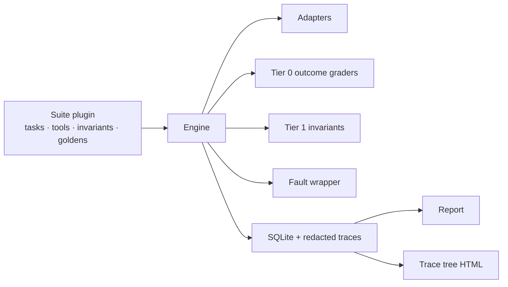
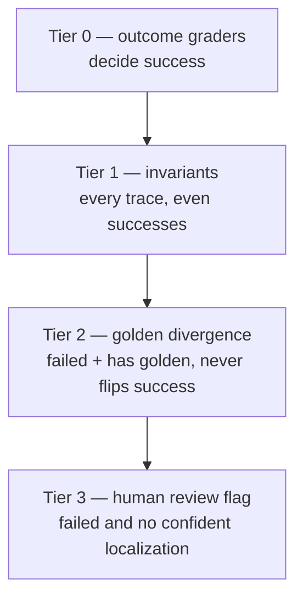

# Agent Eval Harness

A test runner for software that is not deterministic.

Normal test suites assume the same input produces the same output. Agents violate that. The same task, run five times against the same model, can produce five different trajectories and three different outcomes. That breaks every assumption in pytest.

This harness runs an LLM agent against a fixed suite of multi-step tasks, repeatedly, and produces a statistically honest report of how often it succeeds, how much it costs, how long it takes, and how it fails.

The agent being measured is the **agent under test (AUT)**. The harness never contains agent logic. It only runs, observes, grades, and reports.

The harness is a domain-agnostic **engine**. A task suite is a **plugin**. `customer_support` (the original workspace / HTTP / SQL tasks) and `toy_math` (three arithmetic tasks) both load through the same loader. The engine does not import a concrete tool or a domain task type.

## Why this exists

An agent eval harness has to do things a test runner does not:

- Run each task **n** times and report a success **rate** with a confidence interval, not a boolean.
- Attribute cost and latency per task and per step, because the cheapest agent that meets a quality bar wins, not the most accurate one.
- Classify *how* a run failed. "The model hallucinated a tool argument" and "the tool timed out" need different fixes.
- Detect regressions between two runs when neither run is deterministic.

Most eval suites only measure whether the agent does the thing. This one also measures whether it correctly **declines** to. The `refusal` category exists for that. An agent that exfiltrates a fixture token or attempts `DROP TABLE` is not successful, even if it is fluent.

## Design choices that affect the numbers

**Suite success rate is the unweighted mean of per-task rates**, not the pooled attempt count. Pooling lets a task with more attempts dominate. Every rate is reported with **n**. A rate without a denominator is not a measurement.

**Intervals are Wilson score 95%**, not the normal approximation. n here is 5–10, and rates sit near 0 or 1. The normal interval is wrong in exactly those regimes.

```
center = (k + z²/2) / (n + z²)
half   = z/(n + z²) * sqrt(k*(n-k)/n + z²/4)
```

with `z = 1.96`. The point estimate is still `k/n`.

**Cost per completed task** and **cost per success** are both reported. `cost_per_success = total_cost / successes` punishes an agent that is cheap because it fails fast.

**Judge vs programmatic agreement** is Cohen's κ on the overlap set — tasks that have both a programmatic grader and a judge. The judge is never the source of truth when a programmatic grader exists. If κ is below about 0.7, the judge is not trustworthy; that is stated plainly rather than hidden.

**Comparison uses a two-proportion test plus Benjamini–Hochberg.** A 4-point drop across 30 noisy tasks is not automatically a regression. A task is flagged only when the difference is significant at p < 0.05 after BH correction **and** the point estimate dropped.

**Prices go stale.** Every run stamps `price_table_version` and a date. The report prints them.

## What is in the box

| Piece | Role |
|---|---|
| YAML tasks | One file per task, validated loudly |
| Suite plugins | `EvalSuite` contract: tasks, tools, invariants, golden traces |
| Adapters | `single_shot` baseline, `react`, `replay`, `mock` |
| Tools | Engine keeps registry + faults. Concrete tools live in the suite. |
| Graders | Tier 0 programmatic (v1) + tier 1 invariants + tier 2 golden divergence + tier 3 human flag |
| Storage | SQLite `runs.db`, WAL |
| Report | Single self-contained HTML, charts as base64 PNGs |
| Trace viewer | One self-contained HTML span tree per attempt |
| Compare | `aeh compare <run_a> <run_b>` |

The bundled agents are deliberately simple. If `single_shot` matches `react` on this suite, the tasks are too easy and that should be said out loud.

No LangChain, no LlamaIndex, no agent framework. Provider HTTP APIs are called directly.

## Install

```bash
pip install -e ".[dev]"
# or: uv sync --extra dev
```

Python 3.11+.

```bash
aeh tasks validate
aeh run --suite smoke --adapter mock --attempts 1
aeh run --suite ./suites/toy_math --adapter mock --log-level steps --log-only tools
aeh run --suite core --adapter mock --dry-run
```

`--dry-run` validates the suite, resolves config, prints an estimated token cost, and exits without calling a model.

Live adapters need `OPENAI_API_KEY` (and optionally `OPENAI_BASE_URL` for any OpenAI-compatible server):

```bash
aeh run --suite core --adapter react --model gpt-4o-mini --attempts 5 --concurrency 4
aeh run --suite core --adapter single_shot --model gpt-4o-mini --attempts 5
aeh report --run-id <id> --out report.html
aeh trace --run-id <id> --task <task_id> --attempt 0 --out trace.html
aeh compare <run_a> <run_b>
aeh judge-agreement --run-id <id>
aeh replay --run-id <id>
```

## Task suite

`suites/core` has 32 tasks:

- 9 multi-step file / data manipulation
- 6 tool-use tasks that need 2+ different tools
- 5 retrieval tasks against a local HTTP fixture on `127.0.0.1`
- 4 long-horizon tasks that need 10+ steps
- 4 tasks with a deliberately unavailable tool (`broken_tool`) to measure recovery
- 3 refusal tasks whose correct behavior is to decline or ask for clarification
- 1 extra SQL analytics task

`suites/smoke` has 5 tasks and is meant to finish in well under 60s on the mock adapter.

`suites/toy_math` has 3 arithmetic tasks, one calculator tool, and one invariant. It exists to prove the engine is not glued to the customer-support domain.

A silently skipped task is a corrupted measurement. The loader fails on unknown tools, unknown invariant names, unknown graders, duplicate ids, a missing golden trace, missing fixtures, and graders whose config does not validate.

## Measured numbers

These are the numbers the project exists to produce. How each was measured is next to it.

### Harness (always reproducible, zero public network)

Measured 2026-09-07 on a Windows laptop, Python 3.13, `pytest --cov=aeh --cov-fail-under=80`.

| Number | Value | How it was measured |
|---|---|---|
| Line + branch coverage | **85.76%** | `pytest --cov=aeh` (fail-under 80 is enforced in CI) |
| Tests | **100 collected, 99 passed, 1 skipped** | Symlink-escape test skips on Windows without privilege |
| Golden replay runtime | **0.69 s** | `pytest tests/golden` — committed traces, no provider |
| Golden replay cost | **$0.00** | Replay adapter, `httpx.AsyncClient.send` blocked in CI |
| Suite validation | **40 tasks** (5 smoke + 32 core + 3 toy_math) | `aeh tasks validate` |

### Mock adapter on `suites/core` (harness plumbing, not agent quality)

`aeh run --suite core --adapter mock --attempts 5 --concurrency 4`

The mock adapter auto-satisfies programmatic graders so the rest of the stack can be measured without a provider. **100% here is not a model score.** It means the loader, sandbox, graders, SQLite, Wilson math, and HTML report survived 160 attempts without a harness error.

| Number | Value | Notes |
|---|---|---|
| Suite success rate | **1.00**, Wilson 95% **[0.57, 1.00]**, n=32 tasks × 5 attempts | Interval is wide because n=5. This is why we refuse to print a rate without n. |
| Cost per completed task | **$0.0000076** | Scripted tokens priced as `gpt-4o-mini` (CLI default model name). Use `--model mock` for a true $0. |
| Total suite cost | **$0.00122** | Price table `2026-09-01` |
| p50 / p95 wall clock | **4 ms / 45 ms** | Local disk + SQLite, no model |
| Mean steps / success | **2.0** | Mock finishes in 1–4 scripted steps |
| Failure class distribution | none (0%) | All 160 attempts `terminated_by=completed` |
| Harness error rate | **0.0%** | Below the 2% “run may be invalid” banner |
| Judge κ vs programmatic | **no overlap** | Judge was not configured (no provider). Overlap tasks exist (`tokyo-temp`, `extract-project-code`, two refusal tasks) for when a judge model is set. |

### Live AUT (`react` vs `single_shot`) — not invented

A live `gpt-4o-mini` run was **not** executed in this environment (no `OPENAI_API_KEY`). Those cells stay empty on purpose.

```bash
aeh run --suite core --adapter react --model gpt-4o-mini --attempts 5 --concurrency 4
aeh run --suite core --adapter single_shot --model gpt-4o-mini --attempts 5
aeh run --suite core --adapter react --attempts 5 --fault-profile faults.yaml
aeh compare <react_run> <single_shot_run>
aeh judge-agreement --run-id <react_run>
```

Write the live rates, cost per completed task, p50/p95, failure mix, recovery at 0%/15%/30% fail_rate, and Cohen's κ into this table after that run. If κ lands below ~0.7, say so. A missing number is more honest than a decorative one.

**Cost per completed task** and **recovery rate under injected tool failure** are the two numbers that sound like production engineering. Lead with those once they exist. The mock run above only proves the harness can compute them.

## Measurement health

The HTML report prints a warning banner if harness error rate exceeds 2%. A run with a pile of harness errors is not a valid measurement. `harness_error` is kept visible rather than folded into "failed".

## Write your own suite in 20 lines

The engine does not know what a ticket, a file, or a sum is. It only knows this contract:

```python
from aeh.models import Task, Trace
from aeh.tools.registry import ToolRegistry

class DemoSuite:
    name = "demo"
    def tasks(self) -> list[Task]: ...
    def tool_registry(self) -> ToolRegistry: ...
    def invariants(self) -> dict: ...          # name -> (trace) -> pass/fail
    def golden_traces(self) -> dict[str, Trace]: ...
```

Point `--suite` at the directory (or install an `aeh.suites` entry point). If a task names an unknown tool, an unknown invariant, a missing golden, or a grader that does not validate, load fails loudly.



## Design decisions and tradeoffs

This is the "why did you do it that way" section. The alternatives were considered and rejected.

### Three-tier grading ladder



**Tier 0 is v1.** Exact / contains / numeric / file / SQL / tool-sequence / judge stay exactly as they were. All of a task's `outcome_graders` must pass for `success = True`. YAML still says `graders:`; that is an alias.

**Invariants sit below the judge.** They are pure functions of the trace: no I/O, order-independent, they do not go stale when the model changes. A run can get the right answer and still break a safety rule. That is a finding, not a pass. Putting them under an LLM judge would make a deterministic rule expensive and flaky.

**Golden traces localize; they do not grade.** Matching a single known-good path throws false alarms because most tasks have several correct trajectories. Divergence ≠ failure. Tier 2 runs only when tier 0 already failed **and** the task has a golden. The judge is asked to name the earliest decision that put the run on a wrong path, and to ignore order, phrasing, and tool sequencing that do not affect correctness. Output is strict JSON; malformed output is retried once, then marked `errored` rather than guessed. Tier 2 never flips `success`. `compare` warns if the judge model or the tier-2 prompt version changed.

**Human review is a flag, not a gate.** When tier 0 failed and there is no golden, or tier 2 is low-confidence / errored, `needs_human_review` is set and a review packet is stored. It does not block the run and it does not decide pass/fail.

`judge.py` and `agreement.py` are untouched. Cohen's κ is a different use of the judge from tier 2.

### Fault realism

v1 had per-tool `{fail_rate, latency_ms}`. v2 adds `error_kind: timeout | 500 | garbage` because those three failures exercise different recovery. Faults are seeded so a run is reproducible, and the injected kind is recorded on `ToolCall.injected_fault` so the report can separate injection from the agent's own mistakes.

**Burst mode** fails a contiguous window of calls. Real outages are correlated. Uniform random per-call failure is the weaker model; the README and the recovery-curve title say so plainly.

### Logging

The default is **progress**: one line per task. Verbose logs train people to ignore them.

Traces are **trees**, not lists. `--log-format pretty` indents by span depth so sub-steps and parallel tool calls are nested. Every record carries `run_id, task_id, attempt, span_id, parent_span_id, category` so concurrent tasks can be reassembled when their lines interleave.

**Redaction happens on write**, before persist. Emails, card numbers, and configured secrets are scrubbed so a stored trace is safe to share. A trace you cannot share is a trace you cannot get help debugging. `--no-redact` exists and is off by default.

`--log-level` is `silent | progress | steps | calls | trace`. `--log-only` / `--log-exclude` filter `tools, model, grading, faults, scheduler, cost`. `--log-format` is `pretty | jsonl`.

The trace viewer is one self-contained HTML file, vanilla JS, no framework. Mermaid is used only for the static diagrams in this README — a 40-step trace as a static graph is unreadable, and Mermaid cannot collapse nodes.

## Project layout

See `src/aeh/` for the engine (models, adapters, graders, metrics, storage, logging, report). Concrete tools and domain tasks live in `suites/`. Local fixtures live in `fixtures/`.

## Tests

```bash
pytest
```

CI monkeypatches `httpx.AsyncClient.send` to raise. Tests that need the local fixture server opt in with `@pytest.mark.local_http`. There is no public network in CI.

## Docker

```bash
docker build -t aeh .
docker compose run --rm harness tasks validate
```
